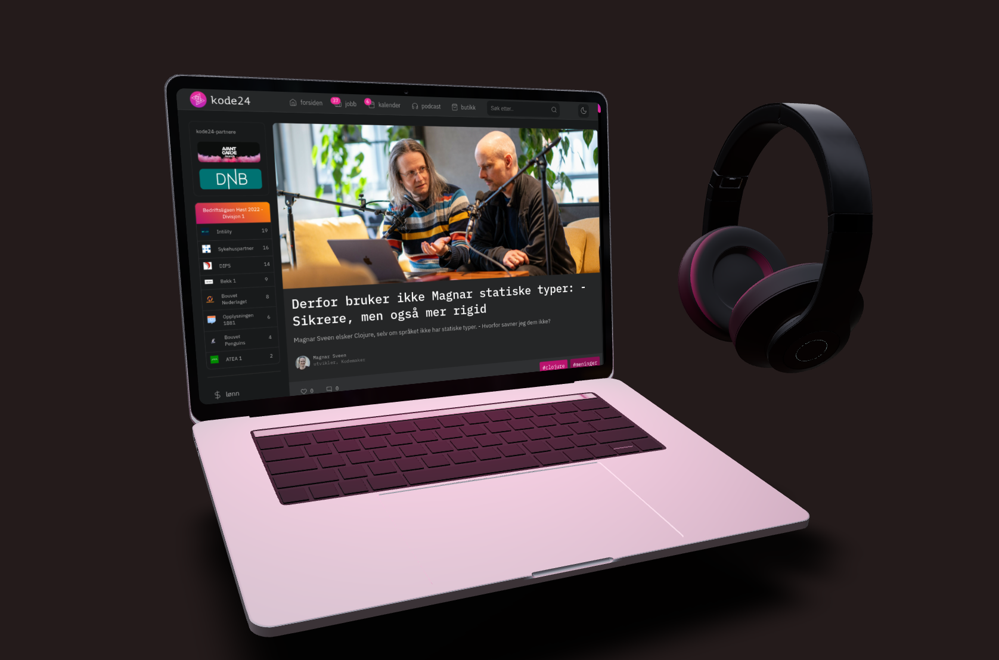

# Kode24 3D

Du kan se en demo [her](https://3dkode24.netlify.app/).



---

## Oppsett

Installer NPM moduler.

```
npm install
```

Start dev serveren.

```
npm run dev
```

---

## Ressurser

En liten gjennomgang av rammeverkene brukt i prosjektet.

### [ThreeJS](https://threejs.org/)

ThreeJS er go-to biblioteket for 3D på web og har vært det i lang tid. Det er fundamentet for nesten alle 3D prosjekter på web, inkludert dette.

### [React Three Fiber](https://docs.pmnd.rs/react-three-fiber/getting-started/introduction)

React three fiber er en "React renderer for three.js.". Den gjør det enkelt å jobbe med Three i React.

### [Drei](https://github.com/pmndrs/drei)

Drei er et stort bibliotek med komponenter og helpers for React Three Fiber. De komponentene som er brukt her er:


#### [Environment](https://github.com/pmndrs/drei#environment) 

`Environment` gjør det enkelt å laste inn et enivronment map som gjør at objektene i scenen din kan plukke opp lys og skygge informasjon fra environmentet du har valgt. 

#### [Float](https://github.com/pmndrs/drei#float)

`Float` funker litt sånn som du vil tro. Den får objektene til å flyte subtilt rundt, du kan endre på hastigheten og andre paramtere via props.

#### [Html](https://github.com/pmndrs/drei#html)

`Html` komponenten Lar deg koble HTML innhold mot objekter i scenen din. I dette prosjektet har vi lagt inn en iframe, men du kan legge inn hva som helst av vanlig html. 

PS: Hvis du vil se din egen nettside på laptopen, er det bare å oppdatere iframe URLen!

---

## Lær mer om 3D

Hvis du syntes 3D på web er interessant så anbefaler jeg på det varmeste kurset til [Bruno simon](https://threejs-journey.com/#). Dette prosjektet er basert på en av videoene i kurset. Du kan hoppe rett inn i react-three-fiber og drei. Men jeg anbefaler å gå litt dypere i threejs basics, slik at du har et bra fundament og forstår hva som skjer "under the hood".

---

## Bidra

Alle bidrag tas i mot med åpene armer! Bare lag en fork av prosjektet og åpne en pull request. Du kan lese mer om hvordan å gjøre det [her](https://docs.github.com/en/pull-requests/collaborating-with-pull-requests/proposing-changes-to-your-work-with-pull-requests/creating-a-pull-request-from-a-fork)

